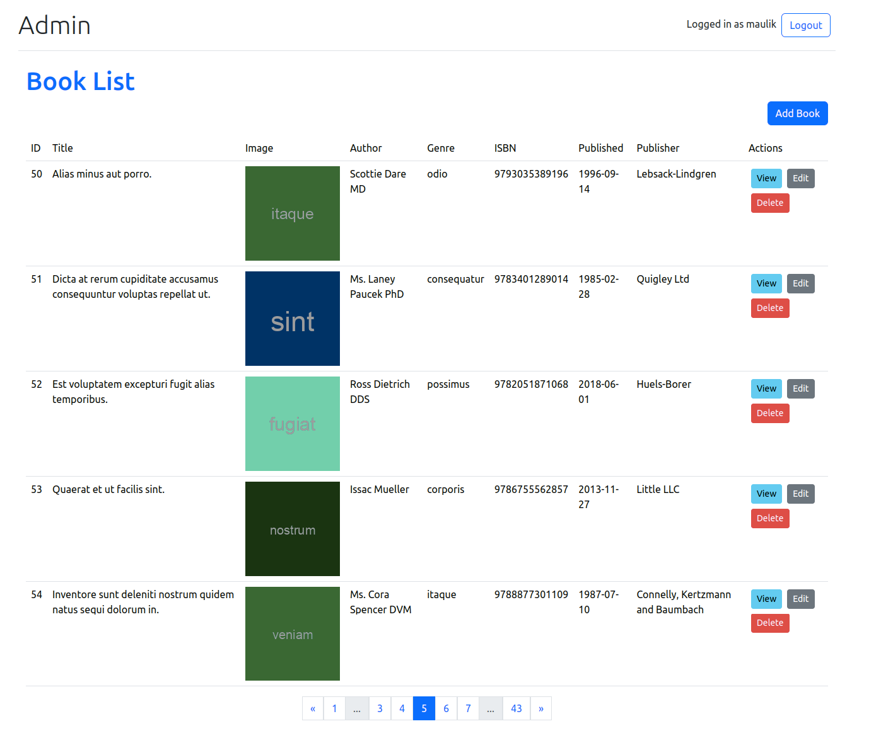

# Vue3 BookStore Application

## Installation

Follow these steps to set up the application:

1. **Clone the repository:**

    ```bash
    git clone https://github.com/maulik4/bookstore-frontend.git
    ```

2. **Navigate to the project directory:**

    ```bash
    cd bookstore-frontend
    ```

3. **Install dependencies:**

    ```bash
    npm install
    ```

4. **Copy the `.env.example` file to `.env`:**

    ```bash
    cp .env.example .env
    ```

5. **Open the `.env` file and set the API and Image URL:**

    ```env
    VITE_API_URL=http://your-api-url
    VITE_API_VERSION=v1
    ```

6. **Run the development server:**

    ```bash
    npm run dev
    ```

7. **Open your browser and navigate to [http://localhost:3000](http://localhost:3000) to view the customer portal.**


8. **Open your browser and navigate to [http://localhost:3000/admin](http://localhost:3000/admin) to access the admin portal.**


## Implementation

### Customer Portal

#### Browse Books

- Navigate to the home page to see a list of all available books.


#### Search Books

- Utilize the search functionality to find books based on title, author, publisher, published date, ISBN, or Genre.


#### View Book Details

- Click on the title of a book to view its details.


### Admin Portal

#### Authentication

- Use the administrator login,logout and registration functionality to access the admin portal


#### Book Management

- Perform CRUD operations for books.




